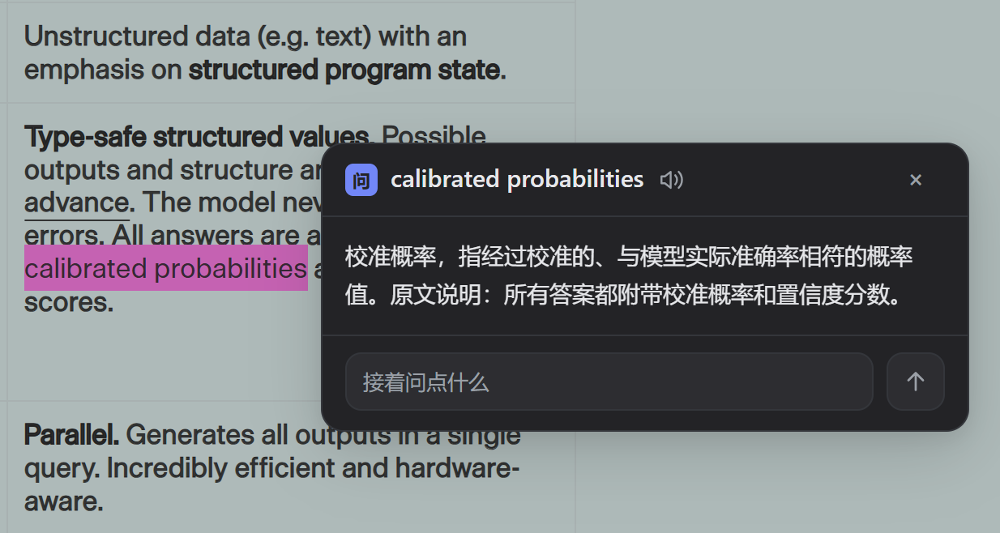
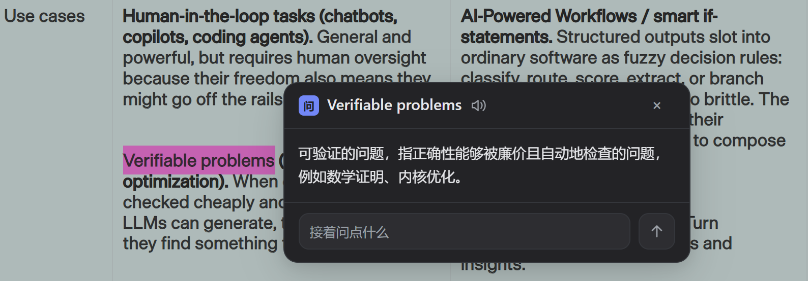

<div align="center">


# DeepSeek 伴读

**读到哪里，就在原文旁理解到哪里。**

选中英文网页或论文 PDF 中的词句，DeepSeek 结合前后文，沿着原文给出直接的中文理解。继续在同一张卡片里追问，也可以听选中内容的英文发音。

Chrome 扩展 · 网页与 PDF · 原文上下文 · 就地追问 · Kokoro 本地发音

</div>

## 阅读场景：一个术语，放回这一段

技术文章里的词未必难，难的是它在这一段里指什么。下面这段文字讨论模型答案附带的概率与置信度：选中 `calibrated probabilities`，伴读卡片先给出“校准概率”的含义，再说明它与原文所述答案的关系。解释留在选区旁边，读完就能接着看下一行。



## 阅读场景：顺着论述继续问

读到 `Verifiable problems` 时，单独翻出“可验证”还不足以接上文章。伴读沿着所在段落说明：这类问题的正确性可以低成本、自动地检查，原文举了数学证明与内核优化的例子。需要再问一句，直接在同一张卡片底部追问，原文与回答始终同屏。



## 核心设计

**以原文为准。** 回答沿用原文的对象、术语、主语和论述顺序，保留比较、限定与不确定性。先给出选中内容的确切含义，再给出原文明确建立的关系；用自然段落直说，不套词典栏目或固定回答模板。

**让阅读保持连续。** 选区自动补齐漏选的单词边界。卡片贴着选区展开，答案流式出现，追问沿用当前上下文与已有对话；读者可以继续看原段落，而不必在页面和聊天窗口之间来回切换。

**让材料尽量完整。** PDF 阅读器按栏与段落整理文字，合并跨行断词；涉及图表或公式时，支持向视觉模型附上相关页图。文字提取和页图都为理解当前选区服务。

**把发音留在本地。** 词旁扬声器使用 Kokoro Q8 的美式 Heart 音色。首次安装自动下载约 92 MB 模型，随后可离线发音；可选“点击后生成”或“选中后预先生成”，播放仍由按钮控制，音量可在设置里调节。最多支持 240 个字符的英文词句。

对话历史保存在浏览器本地，最多 200 条；可以搜索并回到原文。界面随系统切换深浅主题，PDF 页面周围采用中性灰色。

## 安装与使用

需要 Chrome 116 或更新版本，以及自己的 [DeepSeek API Key](https://platform.deepseek.com/api_keys)。

1. 从[最新版本](https://github.com/zzkws/deepseek-reading-companion/releases/latest)下载 `deepseek-reading-companion.zip`，解压到固定目录。
2. 打开 `chrome://extensions`，启用开发者模式，点击「加载已解压的扩展程序」，选择解压后的目录。
3. 在自动打开的设置页填写 API Key，测试连接并保存；语音模型的下载进度也在这里显示。
4. 在网页中直接划词；阅读 PDF 时，从扩展菜单打开 PDF 阅读器并拖入文件。

升级时替换原安装目录中的文件，重新加载扩展，并刷新已打开的阅读页面。

从源码构建：

```bash
git clone https://github.com/zzkws/deepseek-reading-companion.git
cd deepseek-reading-companion
npm ci
npm run build
```

在 `chrome://extensions` 加载生成的 `dist/`；`npm run zip` 可生成安装包。

## 数据与边界

解释和追问需要联网。选中内容、所需前后文，以及 PDF 查询涉及的页图会发送到设置中的 API 地址，默认是 DeepSeek；API 调用使用你的账户。API Key 与对话历史保存在本机 `chrome.storage.local`。

Kokoro [Q8 模型](https://github.com/zzkws/deepseek-reading-companion/releases/tag/kokoro-v1.0-q8)下载后经过 SHA-256 校验，发音文本在本机处理。PDF 扫描件没有可选择的文字层时暂不能直接划词；复杂公式和表格需要结合原页核对。网页 iframe 内的选区暂不支持。

阅读链路与验证见 [docs/reading-pipeline.md](docs/reading-pipeline.md)，回答原则见 [src/background/prompt.ts](src/background/prompt.ts)。

## 关于这个项目

DeepSeek 伴读是围绕 DeepSeek 模型能力与设计风格制作的独立开源作品，非 DeepSeek 官方产品。谨以此作品，表达本人对 DeepSeek 的喜爱之情。

项目源码采用 [MIT 许可证](LICENSE)；本地发音组件和模型保留各自的许可，见[第三方许可说明](THIRD_PARTY_NOTICES.md)。

<details>
<summary>English</summary>

DeepSeek 伴读 is an independent Chrome reading companion for English webpages and PDFs. Select text to receive a contextual Chinese explanation beside the source, ask follow-up questions in the same card, and hear local English pronunciation with Kokoro Q8. Bring your own DeepSeek API key. Pronunciation works offline after the first model download.

</details>
